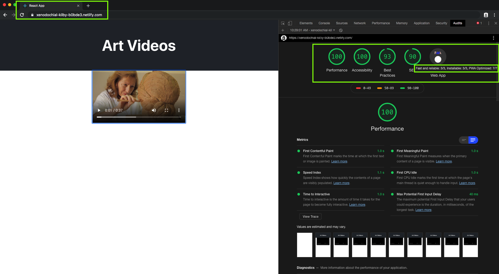

# [art-videos](https://xenodochial-kilby-b0bde3.netlify.com/)

React.JS Progressive Web Application

## Project Description

Single-page applications may be smooth, quick, and effective—but they disappear when the network connection drops.

Progressive web apps (PWAs) work offline, enhancing resilience and allowing developers create seamless user experiences that feel like native apps.

This prove of concept is a training of mine to practice how to build your own PWAs using React.

During this exercise I had build the PWA component, fetch data, use Lighthouse to validate your app, and add offline capabilities to keep your app running even when the internet is down. Plus, practiced how to install your app locally with browsers like Chrome and Safari for iOS.

## POC Objectives

- Creating a PWA component
- Fetching data with React hooks
- Running the build with npm scripts
- Auditing your app with Lighthouse
- Going offline
- Installing the PWA with Chrome and Safari for iOS
- Deploying your PWA on a hosting provider

## PWA Performance Lighthouse Audit

